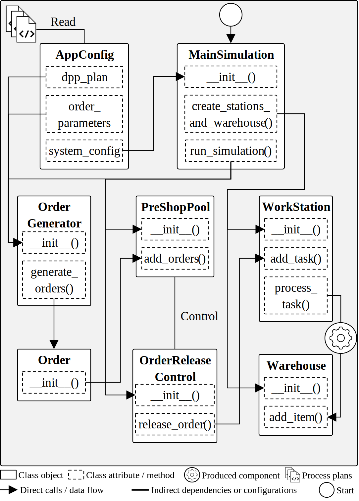
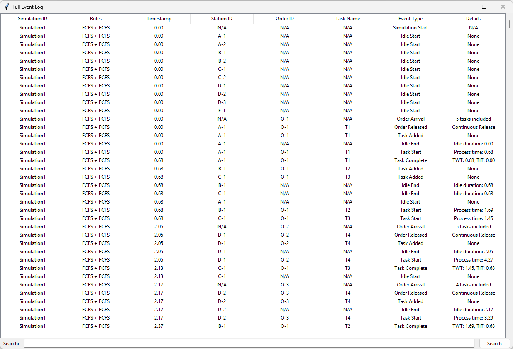
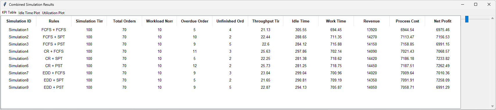
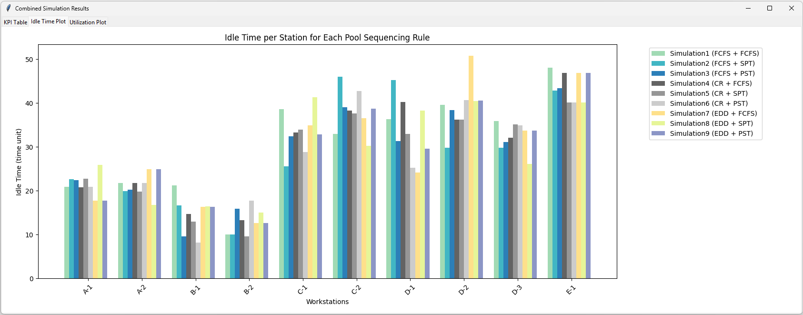
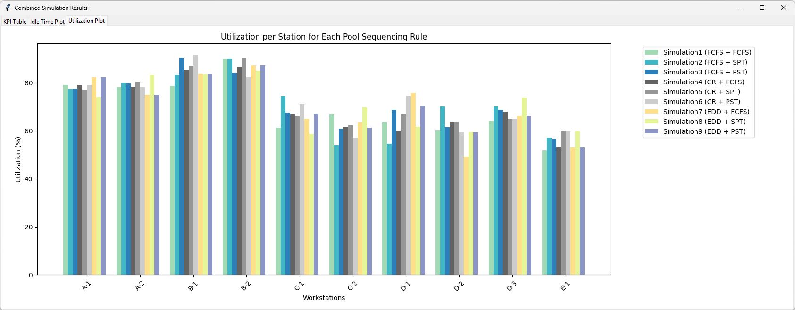

# DisAssembly-MFC (DAMFC)
> **⚠️ Note**
The associated research article for this repository is not yet published. Information such as the DOI and links will be updated after the article is published.


A flexible simulation framework for evaluating Material Flow Control (MFC) strategies in disassembly systems

> **🔬 Research Software Notice**
>
> This is a **research prototype** (v2025.09) developed for academic purposes. It has been verified for the specific scenarios presented in the accompanying research article. Please refer to [LIMITATIONS.md](./LIMITATIONS.md) for more information about the assumptions, scope, and known limitations.

<!-- ================================================== -->
<!-- TOC -->
<!-- ================================================== -->
## Table of Contents
- [Contact](#contact)
- [Introduction](#introduction)
- [Resources](#resources)
- [Usage Instructions](#usage-instructions)
- [Visualization and Analysis Tools](#visualization-and-analysis-tools)
- [Citation](#citation)
- [License](#license)


## Contact
### Contact Details
Patrick Jordan: patrick.jordan@iwb.tum.de  


### Useful Links
- **[Visit our other repositories](https://iwb.github.io)**  
Explore more tools and resources from our research institute.

- **[Visit our institute for more information](https://www.mec.ed.tum.de/en/iwb/homepage/)**  
Learn more about our research and ongoing projects.


<!-- ================================================== -->
<!-- INTRODUCTION -->
<!-- ================================================== -->
## Introduction
This repository provides a modular simulation framework for evaluating Material Flow Control (MFC) strategies in disassembly systems. The framework enables researchers and production planners to assess and compare various pool sequencing and shop floor dispatching rules for disassembly operations. The tools include:


### Software Status
This implementation represents a **research prototype** that:
- ✅ has been **verified** for the scenarios described in the paper (9 rule combinations, 70 orders)
- ✅ **correctly implements** the LUMS-COR mechanism and dispatching rules
- ✅ **produces reproducible results** for the published experiments
- ⚠️ **makes specific assumptions** - see [LIMITATIONS.md](./LIMITATIONS.md)
- ⚠️ **may require modifications** for different use cases


### Components
The framework includes:
1. **DAMFC Core Framework**: a Python-based discrete event simulation that uses SimPy to model disassembly systems with stochastic processing times and uncertain product conditions
2. **LUMS-COR Implementation**: Lancaster University Management School Corrected Order Release mechanism with Planned Completion at Workstation (PCAW) calculations for workload control
3. **Visualization Tools**: bar charts for analyzing simulation results


### Related Research Work
> **⚠️ Note** Updated after the publication of the research article

The framework is part of the research published in the following article:

**"Simulation Framework For Evaluating Pool Sequencing And Shop Floor Dis-patching Rules In Disassembly"**  
*P. Jordan, H. Zhang, M. Wegmann, L. Streibel, C. Reuter, M. F. Zaeh*   
Presented at [Conference (Year)]. [Updated after publication] 

[For more details, please refer to the published article (Link)](#)
[Link is inserted after publication] 

### Abstract
Due to the trend towards a circular economy, the efficient management of end-of-life products and disassembly has become more important. This repository provides a modular simulation framework for evaluating and comparing various production control strategies in disassembly systems. The framework integrates and evaluates different material flow control methods, including the Lancaster University Management School Corrected Order Release (LUMS-COR) approach and various pool sequencing and shop floor dispatching rule combinations. Key performance indicators such as resource utilization, throughput time, and profitability can be assessed, enabling the evaluation of the effectiveness of a chosen combination of pool sequencing and shop floor dispatching rules.


### Acknowledgements
This research was funded by the  Federal Ministry for Economic Affairs and Energy (BMWE) as part of the "Car2Car" project (19S22007H).


<!-- ================================================== -->
<!-- RESOURCES -->
<!-- ================================================== -->
### System Architecture

The framework implements a modular architecture with several core components.

<div align="center">
  <figure>
    
    <br>
    <em>Figure 1: System architecture showing the interaction between core components</em>
  </figure>
</div>

**Core Components:**

1. **Configuration Layer** (`appConfig.py`)
   - reads disassembly process plans from the `input/` folder
   - defines system parameters, such as workload norms, and dispatching rules
   - configures the simulation environment

2. **Control Layer** 
   - `OrderReleaseControl`: implements the LUMS-COR mechanism with pool sequencing rules
   - `PreShopPool`: manages the order queue and release decisions
   - `OrderGenerator`: creates orders based on stochastic arrival patterns

3. **Execution Layer**
   - `MainSimulation`: orchestrates the simulation execution
   - `WorkStation`: processes tasks according to dispatching rules
   - `Warehouse`: stores completed components

4. **Analysis Layer** </br>
Note: This layer is not visualized in Figure 1. The calculation is done by accessing the generated data from the system (architecture).
   - `kpiTracker`: calculates performance metrics
   - `loggerConfig`: records detailed event logs for analysis and verification
   - `processCSV`: generates summary reports


<!-- ================================================== -->
<!-- USAGE INSTRUCTIONS -->
<!-- ================================================== -->
## Usage Instructions
> Before running simulations, please review the [LIMITATIONS.md](./LIMITATIONS.md) file to understand the tested parameter ranges and assumptions.

### Setup
1. **Clone the repository:**
   ```bash
   git clone https://github.com/iwb/ce-damfc-simulation.git
   cd disassembly-mfc
   ```

2. **Install dependencies:**
   ```bash
   pip install -r requirements.txt
   ```

### Quick Start
The framework can run in three modes:

#### 1. Run All 9 Scenarios (Default)
This mode executes all nine rule combinations as outlined in the research article.
```bash
python run_simulation.py
```

This runs the complete set of scenarios:
- Simulation1: FCFS + FCFS
- Simulation2: FCFS + SPT
- Simulation3: FCFS + PST
- Simulation4: CR + FCFS
- Simulation5: CR + SPT
- Simulation6: CR + PST
- Simulation7: EDD + FCFS
- Simulation8: EDD + SPT
- Simulation9: EDD + PST

#### 2. Run Single Simulation
It is possible to run a single simulation using the rules configured in `damfc/appConfig.py`.
```bash
python run_simulation.py --single
```

Before running in single mode, configure your desired rules in `damfc/appConfig.py`.
```python
POOL_SEQUENCING_RULE = "CR"   # Options: "FCFS", "CR", "EDD"
DISPATCHING_RULE = "SPT"      # Options: "FCFS", "SPT", "PST"
```

#### Pool Sequencing Rules (Order Release)
- **FCFS** (First-Come-First-Served): orders are released in arrival sequence
- **CR** (Critical Ratio): priority is based on (time remaining)/(processing time)
- **EDD** (Earliest Due Date): orders with the earliest due dates are released first

#### Dispatching Rules (Shop Floor)
- **FCFS** (First-Come-First-Served): tasks are processed in the order they arrive at the workstation
- **SPT** (Shortest Processing Time): shortest tasks are processed first
- **PST** (Planned Start Time): tasks are dispatched based on backward scheduling from the due date

#### 3. Testing
For quick testing with reduced complexity, use the test module.
```bash
cd damfc
python test.py
```

This runs a simplified scenario with:
- six orders (instead of 70)
- 20 time units (instead of 100)
- single instance per workstation type
- deactivated bar charts

### Configuration
In addition to selecting pool sequencing and dispatching rules, other system parameters can be adjusted in `damfc/appConfig.py`.

```python
# System Parameters
WORKLOAD_NORM = 10             # Workload threshold (WIP limit)
SIMULATION_TIME = 100          # Total simulation duration
TOTAL_ORDERS = 70              # Number of orders to generate

# Order Generation
INTER_ARRIVAL_TIME_MEAN = 0.648  # Mean time between order arrivals
DUE_DATE_RANGE = (40, 50)        # Random due date range

# Workstation Configuration
STATION_TYPES = ['A', 'B', 'C', 'D', 'E']
STATION_INSTANCES = {'A': 2, 'B': 2, 'C': 2, 'D': 3, 'E': 1}
```


### Output Files
All results are saved in the `output/` directory.

| File | Description |
|------|-------------|
| `summary_simulation.csv` | overall KPIs for each simulation (throughput, profit, etc.) |
| `summary_orders.csv` | detailed order-level results |
| `summary_stations.csv` | workstation utilization and idle times |
| `log_events.csv` | complete event log for debugging and validation |
| `log_order_specific.csv` | task execution timeline for each order |
| `log_station_specific.csv` | task processing history for each station |


<!-- ================================================== -->
<!-- VISUALIZATION AND ANALYSIS TOOLS -->
<!-- ================================================== -->
## Visualization
After the simulation run is complete, the **Event Log Explorer** and **Results Viewer** are automatically displayed.

### Event Log Explorer
An Interactive log viewer with search and filter capabilities

<div align="center">
  <figure>
    
    <br>
    <em>Figure 2: Event log explorer with search and filter capabilities</em>
  </figure>
</div>

**Features:**
- **Chronological View**: events are sorted by timestamp
- **Search/Filter Capability**: 
  - find specific order IDs by entering an order ID (e.g., "O-11")
  - filter by station ID (e.g., "B-1")
  - search event types (e.g., "task complete")
- **Double-Click Details**: click any row to view complete order information

### Results Viewer
Closing the Event Log Explorer opens the "Combined Simulation Results" window, which presents the simulation results in a tabbed interface with three main components.


**1. KPI Table Tab**</br>
Table displaying comprehensive performance metrics
- information and metrics shown:
  - **Rules**: pool sequencing and shop floor dispatching rule combination (e.g., "FCFS + SPT")
  - **Total Orders**: number of orders generated and processed during the simulation (default: 70)
  - **Workload Norm**: applied threshold for order release
  - **Overdue Orders**: count of orders exceeding due dates
  - **Unfinished Orders**: orders not completed within the simulated time
  - **Throughput Time Mean**: average time for orders to be completed
  - **Idle/Work Time**: cumulative times across all workstations
  - **Net Profit**: revenue minus process costs
- includes an adjustable font size slider for better readability

<div align="center">
  <figure>
    
    <br>
    <em>Figure 3: KPI table of results viewer</em>
  </figure>
</div>


**2. Idle Time Plot Tab**</br>
Bar chart visualization comparing idle times across workstations
- grouped bars by workstation for each simulation scenario (rule combination)
- supports the identification of:
  - workstations with excessive downtime
  - the impact of different sequencing strategies on idle time
  - bottlenecks in the system

<div align="center">
  <figure>
    
    <br>
    <em>Figure 4: Idle time plot of results viewer</em>
  </figure>
</div>

**3. Utilization Plot Tab**</br>
Bar chart showing the percentage utilization for each workstation
- calculated as: (Work Time / Total Simulation Time) × 100
- allows for visual comparison across different rule combinations
- assists in:
  - identifying underutilized resources
  - detecting overburdened workstations
  - optimizing workload distribution


<div align="center">
  <figure>
    
    <br>
    <em>Figure 5: Utilization plot of results viewer</em>
  </figure>
</div>

## Project Structure
```
disassembly-mfc/
├── damfc/                      # Main simulation modules
│   ├── appConfig.py            # Configuration and scenarios
│   ├── kpiTracker.py           # KPI calculation and visualization
│   ├── loggerConfig.py         # Event logging
│   ├── main.py                 # Simulation environment setup
│   ├── orderReleaseControl.py  # Order release mechanisms
│   ├── preShopPool.py          # Order buffering
│   ├── processCSV.py           # Log processing
│   ├── test.py                 # Test scenarios
│   ├── warehouse.py            # Component storage
│   └── workstation.py          # Workstation processing logic
├── input/                      # Process plans
│   ├── dpp1.json               # Disassembly process plan 1
│   └── dpp2.json               # Disassembly process plan 2
├── output/                     # Simulation results
│   ├── app_*.log               # Debug logs
│   ├── log_*.csv               # Event logs
│   └── summary_*.csv           # Performance summaries
├── LIMITATIONS.md              # Known limitations and assumptions
├── README.md                   # This file
├── requirements.txt            # Python dependencies
└── run_simulation.py           # Main entry point
```


### Customizing Process Plans
To add custom disassembly process plans:

1. create a new JSON file in `input/` following the structure of existing plans
2. reference it in `damfc/appConfig.py`.
   ```python
   with open('input/custom_plan.json') as file:
       CUSTOM_PLAN = json.load(file)
   ```
3. update the OrderGenerator class to include the new plan


<!-- ================================================== -->
<!-- CITATION -->
<!-- ================================================== -->
## Citation
If you use this repository or the tools for your research or industry projects, please cite the following article:
> **⚠️ Note** Updated after the publication of the research article


```bibtex
@article{example_key,
title = {Example Title},
journal = {...}
}
```

## License
This repository and its contents are licensed under the [MIT License](./LICENSE).

---
For questions, suggestions, or collaboration opportunities, please contact the corresponding author or visit our [institute website](https://www.mec.ed.tum.de/en/iwb/homepage/).